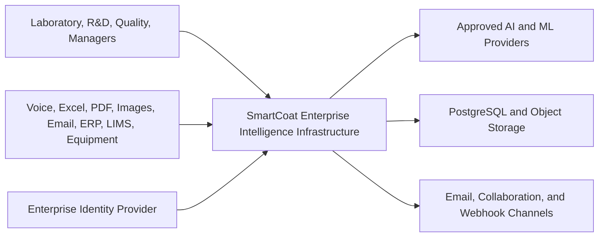
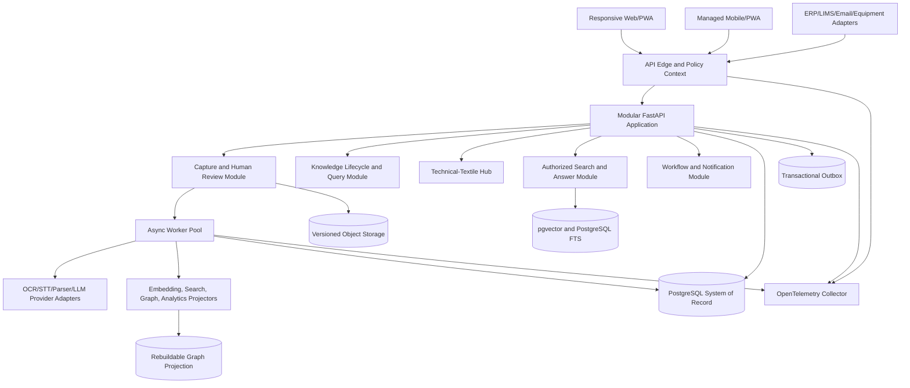
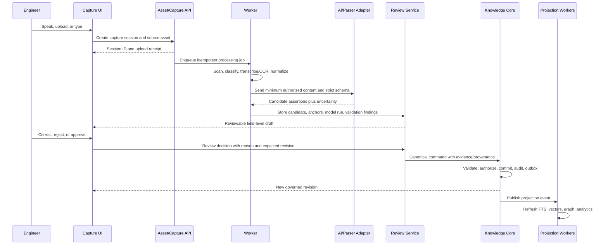

# SmartCoat Enterprise Laboratory Intelligence Architecture

Version: 1.0 Proposed

Date: 2026-08-05

Baseline: `release/1.8-knowledge-capture-core` at `e1fe7f6c0189747aa3f8057251c64efd4ac9759b`

Decision status: Design proposal, not an implementation authorization

Audience: Executive leadership, product leadership, architects, engineers, security, data governance, and laboratory stakeholders

---

## 1. Executive Summary

SmartCoat should evolve from its governed Knowledge Capture Core into an Enterprise Intelligence Infrastructure for industrial research and development. The system should make laboratory reality easier to capture, safer to review, and faster to reuse without replacing professional judgment.

The recommended architecture is an incremental extension of the current FastAPI, Pydantic, SQLAlchemy, PostgreSQL, and Knowledge Object contracts. It is not a rewrite. The existing Knowledge Object v2 model remains the canonical cross-industry knowledge record. New source-asset, extraction-candidate, technical-textile, search, graph-projection, recommendation, and workflow records surround that core through explicit service boundaries.

The first business outcome is intentionally narrower than the full vision: an engineer records or imports an observation, the system produces a structured draft with evidence anchors and uncertainty, a human corrects and approves it, and authorized colleagues can retrieve the approved knowledge with its provenance. Voice, Excel, and PDF are capture channels for the same governed workflow, not separate products.

The architecture follows six non-negotiable rules:

1. AI output is a candidate, never approved knowledge.
2. Every material claim has evidence, provenance, uncertainty, and revision history.
3. Tenant authorization is enforced before retrieval, generation, indexing, and export.
4. Canonical records are separate from source files, derived projections, and model artifacts.
5. Recommendations expose evidence and limitations; they do not silently control laboratory or production equipment.
6. Each major capability advances through measurable gates, controlled pilot data, and an accepted Architecture Decision Record (ADR).

The proposed delivery sequence is:

- Release 1.9: Human Review Interface and production identity foundation.
- Release 2.0: AI-assisted voice, PDF, and Excel capture MVP.
- Release 2.1: controlled technical-textile pilot and hybrid retrieval.
- Release 2.2: commercial multi-tenant hardening, integrations, and operational controls.
- Release 2.3: governed recommendations, pattern discovery, and graph-assisted analysis.
- Release 2.4+: predictive models, optimization, digital-twin experiments, and bounded laboratory automation.

An initial usable pilot is a 9-12 month program under the assumptions in this document. A sellable enterprise product is more realistically an 18-24 month program. The indicative total fully loaded investment is EUR 1.2-2.5 million, excluding customer-specific ERP/LIMS integration, certified regulatory work, and specialized production hardware. These are planning ranges, not vendor quotations.

## 2. Status, Scope, and Non-Claims

This document provides a target architecture and roadmap. It does not accept a technology decision, authorize real industrial data, or claim that the following exist today:

- production identity and access management;
- legally validated retention or records-management policies;
- verified tenant isolation;
- production voice or model-provider contracts;
- automated PDF or Excel promotion into canonical knowledge;
- a production vector database, knowledge graph, or recommendation engine;
- autonomous laboratory control;
- GDPR compliance by architecture alone.

Implementation of those capabilities requires accepted ADRs, threat modeling, data-protection review, tests, operational evidence, and human approval. Synthetic, anonymized, generalized, or metadata-only data remains the default until the governance gates authorize otherwise.

## 3. Current-State Assessment

### 3.1 Existing strengths

The Release 1.8 baseline already contains the right governed foundation:

- a bounded Knowledge Object v2 model with organization, ownership, confidentiality, lifecycle, uncertainty, evidence references, context references, relationships, and revisions;
- structured Evidence and Provenance contracts, including source and transformation metadata;
- explicit lifecycle commands and optimistic revision control;
- immutable audit-event contracts and an atomic unit-of-work boundary;
- deterministic filtered query contracts with signed cursor pagination;
- PostgreSQL persistence models for knowledge, evidence, provenance, context, relationships, and audit events;
- a technical-textile canonical schema proposal and a metadata-first ingestion foundation;
- a narrow laboratory observation form and API route that prove the governed write path;
- canonical enterprise vocabulary and explicit human-oversight levels.

The canonical sources are the [Release 1.8 definition pack](../../docs/project/RELEASE_1_8_DEFINITION_PACK.md), [Knowledge Object v2](../../src/smartcoat/domain/knowledge_objects_v2.py), [Evidence and Provenance](../../src/smartcoat/domain/evidence_provenance.py), [lifecycle](../../src/smartcoat/domain/knowledge_lifecycle.py), [audit](../../src/smartcoat/domain/knowledge_audit.py), and [query](../../src/smartcoat/domain/knowledge_query.py) contracts.

### 3.2 Current workflow

The current laboratory observation vertical slice is:

```text
Engineer -> manual HTML form -> FastAPI route -> governed domain object
         -> repository/unit of work -> PostgreSQL -> list/detail response
```

This is useful as an architectural proof, but it still asks a person to remember and type structured information. It does not yet provide production authentication, source-file custody, AI extraction, field-level review, semantic retrieval, or business automation.

### 3.3 Current implementation boundaries

The present `knowledge_objects.py` vocabulary defines cross-industry knowledge types such as Observation, Evidence, Hypothesis, Finding, Lesson Learned, Failure Mode, Root Cause, Recommendation, and Decision Rationale. The v2 model strengthens this vocabulary without replacing it. That distinction should remain:

- Knowledge Object: governed, reusable meaning and claim.
- Industry record: project, trial, formulation, sample, process condition, test result, equipment, customer requirement.
- Evidence asset: source file or external record plus immutable version and anchors.
- Candidate: unapproved model or parser output.
- Projection: rebuildable search, vector, graph, analytics, or feature representation.

### 3.4 Current operational risks

| Area | Current limitation | Consequence |
| --- | --- | --- |
| Identity | Actor and organization can be supplied through a narrow interface | Not safe as a production trust boundary |
| Capture | Manual form is the primary path | Incomplete observations and low adoption |
| Source custody | No governed raw-asset store | Weak file integrity and source reconstruction |
| Ingestion | Metadata dry run only | Historical PDF/Excel content remains disconnected |
| Search | Deterministic filters only | Conceptual reuse questions cannot be answered |
| AI | Agent, retrieval, and embedding components are placeholders | No evidence that model-assisted capture is reliable |
| Persistence | Some structured values are serialized into text | Harder validation, indexing, and evolution |
| Tenancy | Organization is metadata, not a proven isolation boundary | Cross-tenant exposure risk |
| UI | Minimal HTML observation flow | No field-level review, provenance viewer, or dashboard |
| Operations | No production SLO/DR evidence | Commercial service reliability is unproven |

## 4. Gap Analysis and Business Outcomes

| Problem | Required capability | First measurable outcome |
| --- | --- | --- |
| Failures and lessons are forgotten | Voice/import capture plus prompted completion | At least 80% of pilot records include outcome and lesson or an explicit unknown |
| Process parameters remain prose | Typed measurements with unit, state, source value, and conditions | At least 90% of required pilot parameters are structured or explicitly marked unknown/not measured |
| Test context is incomplete | Test method, standard, acceptance criteria, result, and evidence model | Every approved pilot result links to method and evidence or a recorded exception |
| Files and samples disappear | Versioned asset, sample, shipment, and custody records | Authorized users can reconstruct a reviewed record from its source anchors |
| Business rationale is missing | Customer requirement, feasibility, cost, reuse, and decision-rationale context | Review workflow prompts for rationale before approval |
| Data is fragmented | Connectors, source inventory, canonical mapping, and hybrid retrieval | One authorized search spans governed knowledge and approved source-derived records |
| Repeated work is hard to detect | Similarity, graph context, duplicate rules, and recommendations | Pilot users report measurable reuse and fewer duplicate investigations |
| Nobody knows what changed | Append-only audit, revision, lineage, and review history | Every mutation has actor, reason, timestamp, before/after reference, and correlation ID |

The [pilot use-case portfolio](../../docs/pilot/PILOT_USE_CASE_PORTFOLIO.md) and [pilot success metrics](../../docs/pilot/PILOT_SUCCESS_METRICS.md) remain the governing starting point. The architecture should not widen the pilot before that narrow flow is reliable.

## 5. Architecture Principles

1. **Extend the governed core.** Add modules around Knowledge Object v2; do not fork or replace its canonical semantics.
2. **One promotion path.** Voice, manual entry, PDF, Excel, email, ERP, and machine data all produce candidates that pass validation and review before canonical persistence.
3. **Evidence before fluency.** A polished answer without authorized evidence is a failure.
4. **Unknown is data.** Preserve `unknown`, `not_measured`, `not_applicable`, and `conflicting`; never invent values to complete a schema.
5. **Structured facts before embeddings.** Keep measurements, units, identifiers, lifecycle, and access labels queryable as typed data.
6. **Canonical source, rebuildable intelligence.** Search indexes, vectors, graph edges, analytics marts, and ML features are projections.
7. **Authorization at every hop.** Apply tenant, classification, purpose, lifecycle, and object policy before retrieval and again before response.
8. **Modular monolith first.** Keep transactionally coupled domain behavior together; split services only when scaling, isolation, or ownership evidence demands it.
9. **Asynchronous heavy work.** OCR, transcription, extraction, embedding, and analytics run as durable jobs with idempotency and retry controls.
10. **Provider portability.** Model, speech, OCR, object storage, identity, and deployment integrations use narrow adapters and capability contracts.
11. **Human-controlled autonomy.** Initial AI features operate at L1-L2; writes may use L3 only after explicit approval under the [oversight model](../../docs/governance/HUMAN_OVERSIGHT_AND_AUTONOMY_LEVELS.md).
12. **Observability is evidence.** Service health, model behavior, data quality, policy denials, and business outcomes are measured separately.

## 6. Target Architecture

### 6.1 Logical context



### 6.2 Application containers



### 6.3 Recommended service boundaries

The first production implementation should remain a modular monolith plus independent workers. The modules have explicit Python package, schema, repository, and event ownership even when deployed together.

| Module | Owns | Must not own |
| --- | --- | --- |
| Identity and policy | verified tenant/user context, roles, attributes, purpose, policy decisions | user-entered organization authority |
| Asset custody | uploads, versions, checksums, malware state, retention metadata, source anchors | canonical knowledge meaning |
| Ingestion control | jobs, stages, parser profiles, mappings, failures, idempotency | direct approved Knowledge Object writes |
| Candidate and review | extracted candidates, assertions, questions, corrections, approval decisions | immutable source bytes |
| Knowledge core | Knowledge Object v2, lifecycle, revisions, evidence/provenance composition, audit | model prompts and raw parser output |
| Technical-textile hub | projects, trials, formulations, samples, process measurements, tests, equipment context | redefining cross-industry knowledge concepts |
| Search and answer | authorized structured/lexical/vector retrieval, citations, answer evaluation | source-of-truth records |
| Projection | embeddings, FTS documents, graph edges, analytics facts, feature snapshots | business transactions |
| Recommendation | recommendation candidates, evidence, model/rule version, review, feedback | automatic laboratory actuation |
| Workflow | stateful tasks, deadlines, notifications, connector delivery | domain invariants |
| Commercial control plane | tenant provisioning, plans, entitlements, branding, usage metering | tenant business content |

Extract a separately deployable service only when at least one is true: it needs materially different scaling, failure isolation, data residency, runtime dependencies, or an independently owned release cadence. This avoids premature distributed transactions while preserving an evolution path.

## 7. End-to-End Governed Data Flow



Critical controls:

- The source asset is retained before AI processing, subject to policy.
- The model receives only content permitted for its provider, region, purpose, and classification.
- Candidate storage is physically and logically distinct from canonical knowledge.
- Deterministic validation runs before and after model extraction.
- Approval invokes the existing lifecycle and revision contracts, not a direct table update.
- Projection failures do not roll back the canonical transaction; they are retried and observable.
- Every stage records correlation ID, tenant, asset version, software/parser/model version, schema version, timestamps, and status.

## 8. Data Architecture and Database Design

### 8.1 Data-zone separation

| Zone | Purpose | Mutability | Examples |
| --- | --- | --- | --- |
| Source | Original submitted reality | Versioned/immutable after receipt | PDF, workbook, image, audio, ERP payload receipt |
| Staging | Machine-readable transformations | Append new run; reproducible where possible | OCR text, sheet cells, transcript, table detections |
| Candidate | Unapproved interpretation | Revisioned during review | field assertions, proposed Knowledge Objects, questions |
| Canonical | Human-governed system of record | Domain commands and revisions only | Knowledge Objects, trials, measurements, tests, decisions |
| Projection | Rebuildable access structures | Replace/reindex | FTS, vectors, graph, analytics facts, features |
| Audit | Accountability evidence | Append-only | commands, reviews, policy decisions, exports, model runs |

### 8.2 Existing canonical tables to preserve

Retain and evolve the current Knowledge Object v2 and audit persistence records. Migration must preserve IDs, organization scope, lifecycle, revision, evidence and provenance associations, context, relationships, and audit history. Structured columns may later move from serialized text to native PostgreSQL JSONB only through backward-compatible migrations and tests.

### 8.3 Proposed table groups

Names are conceptual and require schema ADRs before implementation.

| Group | Principal records | Key constraints and indexes |
| --- | --- | --- |
| Tenant and policy | `tenants`, `sites`, `tenant_settings`, `subject_bindings`, `role_bindings`, `policy_versions`, `entitlements` | globally unique tenant; tenant/status indexes; no content in control-plane billing records |
| Source custody | `source_assets`, `source_asset_versions`, `content_objects`, `source_anchors`, `custody_events`, `retention_holds` | tenant + checksum + size; immutable version; unique object key; malware state required before processing |
| Ingestion | `ingestion_jobs`, `ingestion_stages`, `connector_receipts`, `parser_profiles`, `mapping_profiles`, `job_failures` | tenant + idempotency key unique; stage attempt unique; leased worker indexes |
| AI runs | `model_endpoints`, `model_policy_bindings`, `model_runs`, `prompt_templates`, `schema_versions`, `token_usage` | immutable run metadata; provider request ID; content hash, not raw secret-bearing prompts in logs |
| Candidate/review | `capture_sessions`, `extraction_candidates`, `candidate_assertions`, `candidate_questions`, `validation_findings`, `review_tasks`, `review_decisions`, `field_corrections` | candidate never canonical by status change alone; reviewer/decision/reason; source anchor per material assertion |
| Industry hub | `projects`, `customers`, `customer_requirements`, `customer_feedback`, `trials`, `trial_samples`, `materials`, `suppliers`, `material_price_snapshots`, `formulations`, `formulation_components`, `process_runs`, `process_measurements`, `equipment`, `test_methods`, `test_results`, `production_feasibility_assessments`, `shipments`, `sample_custody` | stable tenant-local business keys; typed quantities; effective dates; source/currency on commercial facts; explicit missing-state values |
| Knowledge core | existing Knowledge Object v2, evidence, provenance, context, relationships, revisions | current domain invariants remain authoritative |
| Search | `search_documents`, `search_chunks`, `embedding_models`, `embedding_vectors`, `search_index_runs` | tenant, classification, lifecycle, language, model/version; vector dimension validated |
| Graph | `graph_nodes`, `graph_edges`, `graph_projection_runs` or external projection checkpoints | edge type allowlist; temporal validity; source record and revision required |
| Recommendation | `recommendation_runs`, `recommendation_candidates`, `recommendation_evidence`, `recommendation_reviews`, `recommendation_feedback` | never overwrite history; decision and outcome tracked separately |
| Automation | `workflow_instances`, `workflow_tasks`, `notification_deliveries`, `integration_outbox`, `integration_dead_letters` | idempotent dispatch; retry schedule; human task ownership and deadline |
| Analytics/ML | `quality_snapshots`, `feature_definitions`, `feature_snapshots`, `dataset_manifests`, `model_registry_records`, `evaluation_runs`, `prediction_records` | point-in-time correct; lineage to approved records; no silent training-purpose reuse |

### 8.4 Common record envelope

All tenant content records should carry, where applicable:

```text
id UUID/ULID
organization_id (canonical content partition)
site_id (nullable only when cross-site is explicitly allowed)
classification
lifecycle/status
schema_version
created_at, created_by
updated_at, updated_by
revision
correlation_id
source/provenance reference
retention_class and legal_hold state
```

The authenticated policy context supplies organization and actor. Production APIs must reject attempts to override them through body, query, or untrusted headers. `organization_id` remains the canonical domain term and content-partition key. A commercial tenant maps one-to-one to an organization initially; any future tenant with multiple organizations or shared cross-organization workspace requires an ADR and explicit policy model rather than a second ambiguous content key.

### 8.5 Measurements and process parameters

Temperatures, pressures, humidity, speed, duration, ratios, padder pressure/pickup, dryer zones, curing conditions, and equipment settings must not be flattened into prose. Use a typed measurement pattern:

```text
measurement_id
subject_type + subject_id
parameter_definition_id
canonical_numeric_value (nullable)
canonical_unit (nullable)
original_value_text
original_unit_text
value_state: known | unknown | not_measured | not_applicable | conflicting
tolerance_min/max (nullable)
method/equipment/operator context
observed_at and effective interval
source_anchor_id
quality_status
```

Unit conversion is deterministic and versioned. The original value is always preserved. A model may suggest a parameter mapping but cannot invent a numeric value or unit.

### 8.6 Industry and knowledge mapping

The [technical-textile canonical schema](../../docs/data/TECHNICAL_TEXTILE_CANONICAL_SCHEMA_V1.md) supplies industry entities. Knowledge Objects capture meaning about them:

| Industry fact | Knowledge Object example | Context/evidence |
| --- | --- | --- |
| Trial 18 yellowed at 185 C | Observation | trial + process run + test/photo anchors |
| Excess catalyst may have caused yellowing | Hypothesis | formulation + trial + uncertainty + rationale |
| Replicated tests support catalyst interaction | Finding | test results + method + comparison |
| Keep catalyst below validated range for this substrate | Lesson Learned or Constraint | applicability boundary + approved evidence |
| Use alternative catalyst for next trial | Recommendation | alternatives, expected value, limitations, evidence |
| Team selected catalyst B despite cost | Decision Rationale | approver, alternatives, trade-off, outcome link |

This keeps the cross-industry Knowledge Object vocabulary stable while the technical-textile hub grows independently.

### 8.7 Object storage

Raw files belong in encrypted, versioned, S3-compatible object storage; PostgreSQL stores metadata, checksums, policy, and anchors. Use separate quarantine and accepted prefixes/buckets, tenant-aware keys, short-lived signed access, checksum verification, lifecycle policies, and deny-by-default service identities. WORM/Object Lock may be selected for regulated evidence only after retention/legal review; it is not a substitute for backup or key protection.

## 9. Knowledge Object Extension Strategy

The existing [Knowledge Object vocabulary](../../src/smartcoat/domain/knowledge_objects.py) remains compatible. Additions follow these rules:

1. Prefer new context-reference or industry-record types when the concept is a subject, not knowledge.
2. Add a Knowledge Object type only when it represents reusable meaning not expressible by existing canonical types.
3. Version schemas and provide up/down readers before requiring new fields.
4. Never reinterpret an existing enum value.
5. Preserve old records and expose explicit compatibility metadata.
6. Use lifecycle commands for promotion; do not set `approved` during import.
7. Keep evidence references resolvable even when source access is later restricted.

Potential future extensions, each requiring an ADR and migration analysis:

- `optimization_opportunity`: a bounded opportunity with objective and constraints;
- `scalability_assessment`: laboratory-to-production feasibility claim;
- `compatibility_claim`: material/process compatibility with conditions;
- `customer_feedback_finding`: governed meaning derived from customer evidence.

Do not add Customer, Material, Equipment, Project, Formulation, or Test Result as Knowledge Object types; those are contextual domain records.

## 10. AI Architecture

### 10.1 Capability layers

| Layer | Responsibility | Initial implementation |
| --- | --- | --- |
| Provider gateway | approved endpoints, regional policy, budgets, retries, content classification | adapter interface supporting cloud and on-prem providers |
| Preprocessing | language, OCR/STT cleanup, layout/table/cell segmentation | deterministic tools plus confidence |
| Extraction | schema-constrained candidate assertions | task-specific prompts and strict structured output where supported |
| Validation | schema, vocabulary, units, ranges, references, contradictions | deterministic first; model critique as advisory |
| Review assistance | missing-information questions, source highlighting, summaries | evidence-linked suggestions only |
| Retrieval/answer | authorized hybrid search, reranking, cited answer | approved knowledge by default |
| Recommendation | rules, similarity, statistics, ML candidates | offline/shadow before user-visible release |
| Evaluation | golden sets, correction metrics, safety, drift, value | mandatory per task/model/language |

### 10.2 Candidate contract

Every extraction response should carry:

- task, prompt-template, schema, model, provider, and model-policy versions;
- source asset/version and exact page, region, row, cell, time-span, or record anchors;
- proposed value plus original text/value;
- assertion-level confidence or calibrated uncertainty, not one opaque document score;
- explicit absent/unknown/conflicting states;
- deterministic validation findings;
- model warnings and unsupported fields;
- processing timestamps, cost/usage, region, and correlation ID.

Provider structured-output features reduce syntax errors but do not prove truth. For example, a provider may enforce JSON Schema, while SmartCoat still performs domain validation and human review. The provider gateway prevents provider-specific response formats from entering the domain layer.

### 10.3 Model safety boundaries

- Treat source documents, transcripts, retrieved chunks, and connector content as untrusted data, never instructions.
- Delimit content and prohibit source text from changing tool or policy behavior.
- Do not give extraction models database, filesystem, network, or equipment-control tools.
- Apply output schemas, size limits, enum allowlists, unit validation, and reference validation.
- Redact or block content when provider policy, region, tenant agreement, or purpose disallows processing.
- Store only approved prompt/run metadata; secrets and unnecessary source content stay out of logs.
- Defend against indirect prompt injection in PDF, spreadsheet, email, and retrieved content.
- Run higher-risk model/provider changes in shadow evaluation before promotion.

### 10.4 Human confirmation

The reviewer sees the candidate beside its source, not as a prefilled form that hides origin. Each material field supports accept, correct, reject, mark unknown, and request clarification. Batch approval is unavailable for high-risk claims until risk evidence supports it. Corrections become evaluation data only under an authorized `model_training` purpose.

### 10.5 Evaluation gates

Measure by task and language, not one global accuracy number:

- field precision/recall and exact/normalized match;
- evidence-anchor precision and resolvability;
- unsupported-claim rate;
- required-field completion and explicit-unknown rate;
- reviewer correction rate and time-to-approval;
- lifecycle/policy violation count;
- extraction latency and cost per approved record;
- subgroup performance by document type, language, site, and parser profile;
- retrieval recall@k, nDCG, citation correctness, and permission leakage;
- recommendation calibration, utility, override reason, and observed outcome.

Promotion requires zero known cross-tenant leaks and zero unreviewed AI promotion. Quality thresholds should be agreed for each pilot field based on risk.

## 11. Voice Architecture

### 11.1 Experience

Voice is the fastest capture channel where hands are occupied, but it should not be the only channel. The engineer can press-and-hold or use an explicitly enabled hands-free session, see live transcription, attach project/trial/sample context, pause, edit, and submit for extraction. Ambient recording is off by default.

### 11.2 Pipeline

```text
device capture -> local buffering/noise controls -> encrypted upload/stream
-> consent and session metadata -> language detection -> speech-to-text
-> diarization/terminology normalization -> transcript review option
-> structured candidate extraction -> deterministic validation
-> clarification questions -> field-level human confirmation -> canonical command
```

### 11.3 Design controls

- Explicit recording state, audible/visual cue, consent policy, and configurable retention.
- Push-to-talk default in shared laboratory spaces.
- Offline encrypted queue with mobile-device management controls where required.
- Domain glossary for material names, machine labels, units, multilingual synonyms, and customer-safe aliases.
- Preserve raw transcript and normalized transcript as separate versions when policy allows.
- Anchor assertions to transcript time spans.
- Never infer speaker identity from voice unless separately approved and legally assessed.
- Fall back to text and structured controls in high noise or sensitive contexts.

### 11.4 Proposed nonfunctional targets

- Visible interim transcript p95 within 1.5 seconds on supported networks.
- Final transcript available p95 within 10 seconds after a short recording ends.
- Capture survives transient connectivity loss without duplicate submission.
- Terminology error and downstream correction rates are measured per language/site.

## 12. PDF and Document Intelligence

### 12.1 Processing stages

1. Receive into quarantine with tenant, purpose, classification, filename, MIME claim, and checksum.
2. Enforce size/page limits; inspect actual MIME; malware scan; reject encrypted/unsupported files safely.
3. Create an immutable asset version and page images/text without executing embedded code.
4. Select parser profile: TDS, SDS, equipment manual, SOP, certificate, test report, or generic.
5. Extract native text, OCR only where needed, detect layout/tables, and retain coordinates.
6. Build source anchors and staging artifacts with tool/version/confidence.
7. Produce typed candidates for material properties, hazards, supplier data, process guidance, compatibility, storage, limitations, and references.
8. Validate against vocabularies, units, SDS/TDS profile rules, and cross-page consistency.
9. Route to a qualified reviewer; promote approved records through canonical services.
10. Create authorized search chunks only from eligible content and lifecycle states.

### 12.2 Safety and quality

- Block active content, decompression bombs, oversized images, malformed parsers, and unexpected file types in isolated workers.
- Never execute PDF JavaScript, attachments, or links.
- Keep safety-document revisions distinct; do not silently supersede old records.
- Expose table boundaries and page coordinates to the reviewer.
- Distinguish supplier claims from SmartCoat findings.
- A cited PDF page may support a claim but does not automatically make it approved enterprise knowledge.

## 13. Excel Import Intelligence

Historical workbooks require a mapping and reconciliation product, not a one-click import promise.

### 13.1 Processing stages

1. Quarantine, scan, checksum, and inventory workbook metadata.
2. Parse in an isolated environment with macros disabled and external links unresolved.
3. Inventory visible/hidden sheets, named ranges, tables, formulas, displayed values, merged cells, comments, dates, and units.
4. Detect candidate header rows, repeated blocks, projects, formulations, trials, materials, outcomes, and notes.
5. Propose a tenant/versioned mapping profile with confidence and sample rows.
6. Let a data steward correct the mapping before full dry run.
7. Generate row/cell-anchored candidates, validation findings, duplicate clusters, and reconciliation totals.
8. Review and promote through domain services in bounded batches.
9. Produce an import manifest: rows seen, skipped, failed, duplicated, promoted, and unresolved.

### 13.2 Required preservation

- original workbook and version checksum;
- sheet, row, cell/range, displayed value, raw value, formula, and formatting-derived caveats;
- original identifiers and units;
- success/failure vocabulary mapping and uncertainty;
- mapping profile and parser version;
- reviewer corrections and batch approval;
- duplicate and conflict decisions.

No macro is executed. Formula results are treated as source values unless independently recalculated under an approved profile. Blank does not mean zero, false, failure, or not applicable.

## 14. Retrieval-Augmented Intelligence

### 14.1 Query pipeline

```text
authenticated request
-> policy context and purpose
-> query classification and structured constraints
-> authorized candidate-set construction
-> PostgreSQL filters + full-text search + vector retrieval
-> optional graph expansion within the authorized set
-> deduplication and reranking
-> evidence/lifecycle validation
-> cited response or explicit insufficiency
-> query/decision audit and user feedback
```

### 14.2 Retrieval policy

- Approved and validated knowledge is searched by default.
- Draft/captured/reviewed records are visible only to authorized owners/reviewers and clearly labeled.
- Filters for tenant, site, classification, purpose, lifecycle, language, date, project, material, process range, and test context are applied before vector ranking wherever possible.
- Apply a final authorization check to every result and evidence link.
- Never put unauthorized snippets into the model context, logs, cache, or feedback store.
- Answers distinguish observations, hypotheses, findings, recommendations, and decisions.
- If evidence is insufficient or conflicting, say so and show the conflict.

### 14.3 Example question plans

| Question | Structured retrieval | Semantic/graph retrieval |
| --- | --- | --- |
| Which formulations failed above 180 C? | process temperature > 180, outcome=failure | similar failure-mode and lesson text |
| When did silicone cause curing problems? | material family + curing process + date | semantic failure descriptions and related hypotheses |
| What alternative catalyst solved similar failures? | approved trials/results and formulation components | similarity plus project/material graph neighborhood |
| Which fabrics performed well against washing? | substrate + test method/standard + threshold | semantic customer acceptance context |

## 15. Embedding and Vector Strategy

### 15.1 Recommendation

Start with PostgreSQL full-text search plus pgvector in the existing PostgreSQL estate. This minimizes operational systems, keeps transactional metadata beside vector authorization filters, and supports hybrid retrieval. Adopt a separate vector service only if measured corpus size, latency, tenant topology, or operational requirements exceed the PostgreSQL design.

### 15.2 Index record

Each chunk/vector records tenant, source record/revision, lifecycle, classification, language, content hash, chunk strategy, embedding model/version/dimension, creation time, and eligibility policy version. Content is chunked by semantic structure and evidence boundary, not arbitrary token windows alone.

### 15.3 Indexing approach

- Use full-text and exact filters for identifiers, material names, test standards, and numeric constraints.
- Use embeddings for conceptual similarity.
- Fuse results with a deterministic rank-fusion method and optionally rerank an already authorized shortlist.
- Evaluate HNSW versus IVFFlat on real approved corpus shape; do not choose by popularity alone.
- Partition or index by tenant/lifecycle only when query plans demonstrate value.
- Re-embed asynchronously after model, chunker, content, lifecycle, or policy changes.
- Keep dual indexes during migration and record the active index version per query.
- Delete or quarantine projections when canonical eligibility changes; verify removal.

### 15.4 Tenant isolation

The requirement is tenant-isolated vector retrieval, not necessarily one database per tenant. Offer deployment patterns:

- shared PostgreSQL with row-level security and tenant-filtered indexes for standard SaaS;
- dedicated database/schema and vector indexes for regulated or high-volume tenants;
- customer-managed PostgreSQL/pgvector for on-premises installations.

The policy decision precedes query embedding and retrieval. Cache keys include tenant, subject, purpose, policy version, query hash, and index version.

## 16. Knowledge Graph

### 16.1 Role

The graph is a rebuildable projection for navigation and bounded reasoning. PostgreSQL canonical records remain authoritative. Graph links do not create truth; every node and edge links to a source record/revision, tenant, lifecycle, classification, and provenance.

### 16.2 Initial node and edge types

| Nodes | Representative edges |
| --- | --- |
| Project, Customer, Requirement | `HAS_REQUIREMENT`, `FOR_CUSTOMER` |
| Trial, Formulation, Material, Supplier | `USES`, `PROVIDED_BY`, `ITERATES_ON` |
| Fabric/Substrate, Sample, Shipment | `APPLIED_TO`, `PRODUCED`, `SHIPPED_AS` |
| Process Run, Machine, Equipment | `RUN_ON`, `HAS_CONDITION` |
| Test Method, Test Result, Acceptance Criterion | `MEASURED_BY`, `SATISFIES`, `VIOLATES` |
| Knowledge Object, Evidence, Decision | `ABOUT`, `SUPPORTED_BY`, `CONTRADICTS`, `INFORMED` |
| Person/Team | `AUTHORED`, `REVIEWED`, `APPROVED` |

### 16.3 Evolution

1. Generate controlled edges in PostgreSQL from canonical relationships and events.
2. Prove graph questions, access controls, rebuilds, and business value.
3. Introduce a dedicated graph database only if multi-hop query performance or graph algorithms justify the operational cost.

Graph-generated paths are explanations for retrieval, not causal proof. Causal claims require experimental design and governed findings.

## 17. Machine Learning and Recommendation Roadmap

### 17.1 Maturity ladder

| Stage | Capability | Release condition |
| --- | --- | --- |
| 0 | deterministic completeness, range, unit, and contradiction rules | domain rules agreed and tested |
| 1 | similarity and historical examples | authorized hybrid retrieval meets citation targets |
| 2 | descriptive patterns and repeated-failure clusters | sufficient reviewed data and bias analysis |
| 3 | supervised failure-risk or parameter prediction in shadow mode | point-in-time dataset, baseline comparison, calibration |
| 4 | reviewed recommendations with alternatives and expected value | decision/outcome feedback loop and oversight |
| 5 | constrained optimization/digital-twin experiments | validated process model, safety envelope, expert approval |
| 6 | bounded automation | separate safety case and L3/L4 governance authorization |

### 17.2 Recommendation record

A recommendation is a governed candidate with objective, subject, suggested action, alternatives, constraints, evidence, model/rule version, uncertainty, expected benefit, cost/risk, applicability, expiration, reviewer decision, executed action, and observed outcome. Do not overwrite a recommendation after the outcome is known.

### 17.3 Data and model controls

- Train only from records authorized for `model_training` purpose.
- Build dataset manifests with immutable record revisions and split logic.
- Prevent project/customer leakage across train, validation, and test splits.
- Compare ML with simple rules and historical baselines.
- Evaluate calibration and business utility, not accuracy alone.
- Monitor input, concept, performance, and policy drift.
- Keep model registry, approval, deployment, rollback, and retirement evidence.
- Run recommendations in shadow mode before exposing them.
- Require human approval for laboratory action; no direct PLC/machine actuation in this roadmap.

## 18. Data Quality Architecture

Quality checks run at source receipt, staging, candidate, review, canonical command, and projection stages.

| Check class | Examples | Behavior |
| --- | --- | --- |
| Structural | missing required field, invalid enum, broken reference | block promotion |
| Measurement | impossible range, unit mismatch, ratio sum, timestamp order | block or require justified override |
| Completeness | missing photo, test, process condition, shipment, feedback | warning/task based on record profile |
| Consistency | success status conflicts with failed acceptance criterion | reviewer resolution required |
| Duplication | same source checksum, formulation, trial, sample, or semantic near-duplicate | suggest link/merge; never auto-delete |
| Provenance | unresolved anchor, missing source version, incomplete transformation | block material claim approval |
| Statistical | unusual value or multivariate anomaly | advisory until validated |
| Policy | classification/purpose/retention conflict | deny and audit |

Quality profiles are versioned by record type, tenant, site, and process. Dashboards distinguish unknown data from poor data and show whether warnings were accepted, corrected, overridden, or unresolved.

## 19. API and Backend Architecture

### 19.1 API style

- Versioned REST/JSON APIs for commands, queries, review, assets, search, administration, and integrations.
- Signed upload/download URLs for large assets after policy checks.
- Server-Sent Events or WebSocket for transcription/job progress where needed.
- Webhooks and an outbox for external events; no distributed transaction with ERP/LIMS.
- OpenAPI contracts generated from bounded schemas.
- Idempotency keys for create/import/approval/integration commands.
- Optimistic concurrency through the existing expected-revision contract.
- Stable error envelope with correlation ID, safe message, category, and field details.

### 19.2 Representative resources

```text
/v1/capture-sessions
/v1/source-assets
/v1/ingestion-jobs
/v1/extraction-candidates
/v1/review-tasks
/v1/knowledge-objects
/v1/projects /trials /samples /formulations /process-runs /test-results
/v1/search
/v1/answers
/v1/recommendations
/v1/workflows
/v1/connectors
/v1/admin/tenants /policies /entitlements
```

Routes remain thin. Application services orchestrate authorization, domain commands, repositories, audit, and outbox. Repositories return domain objects, not database rows. Model adapters never import persistence models.

### 19.3 Event contract

Use the Enterprise Event envelope for committed facts. Add event type/version, tenant, aggregate ID/revision, correlation/causation, actor, occurred/recorded timestamps, classification, and minimal payload. The outbox is committed atomically with domain state; consumers are idempotent. Events contain identifiers and safe metadata, not unnecessary source content.

### 19.4 Workflow engine

Start with domain state machines, database-backed human tasks, transactional outbox, and idempotent workers. Adopt a durable workflow engine such as Temporal only when multi-day orchestration, external callbacks, compensations, and operational volume make the additional platform justified. Domain lifecycle remains authoritative either way.

## 20. Automation Pipelines

### 20.1 Capture pipeline

`record/upload -> custody -> scan -> STT/OCR/parse -> extract -> validate -> review -> promote -> project -> notify`

### 20.2 Follow-up pipeline

`approved trial -> detect missing test/feedback/shipment/sample -> create human task -> remind/escalate -> resolve/waive with reason -> audit`

### 20.3 Integration pipeline

`connector receipt -> authenticate/signature check -> idempotency -> stage -> map -> validate -> review policy -> domain command -> outbox acknowledgement/dead letter`

### 20.4 Projection pipeline

`canonical event -> eligibility check -> FTS/vector/graph/analytics update -> checkpoint -> verification -> retry/dead letter`

Each stage has a lease, timeout, retry policy, poison-item path, idempotency key, observable status, and operator replay control. Replay cannot bypass authorization or human-review requirements.

## 21. User Experience Architecture

### 21.1 Role-centered workspaces

| Role | Primary workspace |
| --- | --- |
| Laboratory engineer | capture, assigned review, current trials, samples, missing information |
| R&D lead | project timeline, comparisons, failures/lessons, approvals, reuse candidates |
| Quality/regulatory | test methods, evidence, SDS/TDS revisions, deviations, audit/export |
| Production engineer | approved process windows, scale-up assessments, equipment context |
| Manager/executive | portfolio outcomes, cycle time, reuse, risk, cost and quality trends |
| Data steward | imports, mapping profiles, duplicates, quality queues, vocabularies |
| Tenant administrator | identity mappings, policies, retention, connectors, entitlements |

### 21.2 Interaction principles

- The first screen is an operational workspace, not a marketing dashboard.
- Capture starts in one action: voice, photo, file, or quick note.
- The system asks only unresolved, high-value questions.
- Review compares source and candidate field by field with keyboard-efficient actions.
- Confidence is not hidden behind color alone; show reason and evidence.
- Search results show object type, lifecycle, project context, evidence, and access limitations.
- AI answers are visually distinct from approved records and always cite sources.
- Mobile supports capture/review/status; dense configuration and bulk mapping remain desktop-focused.
- Accessibility targets WCAG 2.2 AA, keyboard navigation, screen reader labels, contrast, and reduced motion.

### 21.3 Conceptual review wireframe

```text
+--------------------------------------------------------------------------------+
| Trial 18 voice capture                     Draft  |  7/9 fields reviewed         |
+--------------------------------------+-----------------------------------------+
| SOURCE                               | EXTRACTED CANDIDATE                     |
| 00:18 "...yellowed after curing..." | Outcome: Failure              [Accept]  |
| 00:24 "...at 185 degrees..."        | Cure temperature: 185 C       [Edit]    |
| 00:31 "...believe excessive..."     | Hypothesis: catalyst level    [Accept]  |
|                                      | Confidence: Medium                       |
| [play] [transcript] [evidence]       | Evidence: transcript 00:18-00:37         |
+--------------------------------------+-----------------------------------------+
| Missing: catalyst concentration, test method                                  |
| [Ask engineer] [Mark unknown] [Save review] [Complete object review]            |
+--------------------------------------------------------------------------------+
```

### 21.4 Conceptual laboratory workspace

```text
+--------------------------------------------------------------------------------+
| Site A | Search knowledge, projects, materials...           [Capture] [Inbox 6]|
+--------------------------------------------------------------------------------+
| Active trials 12 | Reviews due 6 | Missing tests 4 | Follow-ups overdue 2      |
+-------------------------------+------------------------------------------------+
| TODAY                         | KNOWLEDGE TO REUSE                             |
| Trial 18: review transcript   | 3 similar yellowing failures                  |
| Sample S-044: photo missing   | Approved lesson: catalyst/substrate boundary  |
| Project P-102: wash test due  | Alternative used successfully in Project 87   |
+-------------------------------+------------------------------------------------+
| Project timeline | Formulations | Tests | Evidence | Decisions | Activity       |
+--------------------------------------------------------------------------------+
```

### 21.5 Dashboard system

Dashboards are permission-filtered views over defined metrics, not direct arbitrary model summaries.

- Executive: portfolio throughput, experiment cycle time, reuse, avoidable repetition, quality, risk, adoption, value realized.
- Laboratory: active work, review queue, missing fields/evidence, equipment/sample tasks, recent failures and lessons.
- Failure/success analytics: normalized outcome taxonomy, process windows, material/formulation context, evidence coverage.
- Material/customer/equipment explorers: timeline, approved relationships, revisions, restrictions, comparisons.
- Recommendation center: new, reviewed, accepted, rejected, executed, expired, and outcome-measured candidates.
- Knowledge graph: bounded neighborhood with filters, provenance, lifecycle, and why-an-edge-exists detail.

## 22. Frontend and Mobile Architecture

Recommend React with TypeScript as a responsive progressive web application, using an accessible component system and generated API client. Reasons: strong enterprise UI ecosystem, offline/service-worker support, visualization libraries, and hiring availability. The trade-off is introducing a second language/build chain; an accepted frontend ADR should compare this with server-rendered HTML/HTMX for the early review MVP.

Frontend modules mirror backend bounded contexts. Centralize authenticated API access, policy-aware navigation, error handling, feature entitlements, localization, telemetry, and design tokens. Do not duplicate domain validation as an authority; client validation improves usability while the server remains authoritative.

Use native mobile only when camera/audio/background upload, managed-device integration, or offline reliability cannot meet pilot needs through a PWA. For native delivery, share API contracts and design tokens, not business-domain implementation.

Mobile security includes encrypted local storage, minimal offline data, remote session revocation, device attestation where justified, short token lifetimes, no secrets in app bundles, and configurable screenshot/export restrictions for classified content.

## 23. Security, Privacy, and Governance Architecture

### 23.1 Trust model

Use enterprise OIDC for browser/mobile/API authentication and SAML federation through the identity provider where needed. Production tenant, subject, roles, groups, site, and authentication assurance derive from verified claims and server-side bindings. On-premises deployments may use a supported identity broker such as Keycloak; SaaS may integrate with customer identity providers.

Authorization combines:

- RBAC for role capabilities;
- ABAC for tenant, site, project, classification, purpose, lifecycle, ownership, and relationship;
- object-level policy checks for evidence and export;
- database row-level security as defense in depth, not the only application control.

The [confidentiality classification](../../docs/governance/CONFIDENTIALITY_AND_ACCESS_CLASSIFICATION.md) remains canonical: public, internal, confidential, restricted, and strategic.

### 23.2 Tenant isolation

- Tenant context is mandatory in application, job, event, cache, search, graph, object, log, and metrics paths.
- PostgreSQL RLS policies deny access when tenant context is absent; application roles do not own protected tables and cannot bypass RLS.
- Separate service roles for API, worker, migration, backup, and support.
- Object keys and encryption context include tenant; signed links are short lived.
- Search/vector/graph results undergo pre- and post-authorization.
- Background jobs carry signed server-side tenant context, never client-supplied authority.
- Support access is time-bound, approved, purpose-limited, and audited.
- Automated tests attempt horizontal, vertical, cache, export, vector, and job-queue isolation failures.

### 23.3 Encryption and secrets

- TLS in transit; managed keys for database, object, backup, queue, and telemetry storage.
- Per-tenant or dedicated keys for higher tiers where operationally justified.
- Central secret manager, workload identity, rotation, and no secrets in repository/environment artifacts.
- Key deletion/rotation and backup-restore procedures are tested together.

### 23.4 Audit and lineage

Keep domain audit append-only and add security/admin events for login, policy change, evidence access, export, connector, model processing, support access, and retention action. Restrict audit-reader/admin separation. Hash chaining or WORM export can make tampering detectable, but only after an ADR defines threat model, key custody, verification, and retention.

### 23.5 GDPR and records governance

Architecture supports compliance work; it does not declare compliance. Required product controls include data inventory, controller/processor roles, lawful basis and purpose, data-subject handling, minimization, retention schedules, legal holds, regional processing, subprocessor inventory, transfer controls, deletion/anonymization, export, incident response, and DPIA triggers.

Personal data should be separated from experimental content where practical. Derived embeddings, transcripts, model logs, analytics, and backups are included in retention/deletion scope. Legal and records owners decide whether evidence must be retained when a person requests erasure.

### 23.6 Threat priorities

| Threat | Principal controls |
| --- | --- |
| Cross-tenant data exposure | verified context, RLS, policy tests, cache/index isolation, deny-by-default support |
| Malicious PDF/workbook | quarantine, type/size limits, sandbox, malware scan, no macro/script execution |
| Prompt injection/data exfiltration | untrusted-content boundary, no model tools, minimum context, egress/provider policy |
| Poisoned historical data | source provenance, candidate review, lifecycle filters, dataset approval |
| Insecure model provider | approved endpoint/region, contract, no-training setting, redaction, audit, local option |
| Evidence tampering | checksums, immutable versions, custody log, restricted object access, backup |
| Overconfident recommendation | evidence, uncertainty, alternatives, human decision, shadow evaluation |
| Equipment safety impact | no direct actuation; safety case and independent authorization for future control |

## 24. Provenance and Traceability Model

Traceability forms a chain:

```text
physical/digital source
-> source asset version or connector receipt
-> source anchor
-> deterministic transformation(s)
-> model/parser run
-> candidate assertion
-> validation finding
-> human review decision/correction
-> canonical record revision
-> audit event and enterprise event
-> search/graph/analytics projection
-> answer/recommendation/decision
-> execution and measured outcome
```

Every link has a stable ID, tenant, version, timestamp, actor or system identity, software/model version, purpose, classification, and integrity metadata. A user can traverse backward from answer to exact source page/row/time span and forward to decisions/outcomes, subject to authorization.

Physical samples require sample ID/label, storage location, custodian, status, parent trial/formulation, photos, movement events, shipment, disposal, and optional barcode/QR. The system records custody events; it does not claim physical custody merely because a database row exists.

## 25. Commercial SaaS and Product Architecture

### 25.1 Deployment offers

| Offer | Isolation | Intended customer | Trade-off |
| --- | --- | --- | --- |
| Standard SaaS | shared control/application plane, RLS-isolated tenant data | small/mid-size labs | lowest cost; strongest need for automated isolation evidence |
| Dedicated SaaS | dedicated database/storage/keys, optional dedicated workers | regulated/large enterprise | higher cost and operational inventory |
| Customer cloud | SmartCoat deployment in customer account | residency/control-sensitive enterprise | shared responsibility and upgrade complexity |
| On-premises | customer infrastructure with supported package | disconnected or restricted sites | limited telemetry, hardware variability, slower upgrades |
| Air-gapped profile | offline artifacts, local identity/models, signed updates | exceptional high-security use | highest cost; narrower AI/provider capabilities |

### 25.2 Control plane and data plane

The commercial control plane manages tenant provisioning, plans, feature entitlements, branding, supported versions, license state, aggregate usage, and deployment health. It does not hold tenant experimental content. Each data plane enforces local policy and remains functional through bounded control-plane outages.

### 25.3 Feature tiers

| Tier | Candidate capabilities |
| --- | --- |
| Foundation | governed capture/review, evidence, search, audit, project/trial context |
| Professional | voice, PDF/Excel mappings, dashboards, workflows, standard connectors |
| Intelligence | hybrid retrieval, cited assistant, quality analytics, reviewed recommendations |
| Enterprise | SSO/SCIM, dedicated isolation options, customer keys, advanced retention, audit export, premium integrations |
| Regulated/On-prem | validated deployment profile, local models, controlled updates, enhanced support evidence |

Entitlements affect access to features, never the integrity or readability of already-owned customer records. Export and exit plans are product requirements.

### 25.4 White label and plugins

White labeling uses tenant design tokens, logo assets, terminology aliases, report templates, and domain configuration. It must not fork application code or canonical vocabulary.

A future plugin ecosystem starts with signed server-side connector packages and declarative schemas. Plugins run with explicit tenant grants, scopes, network allowlists, quotas, version compatibility, secrets isolation, audit, and revocation. Arbitrary in-process customer code is not allowed in the SaaS runtime.

### 25.5 Go-to-market sequence

1. Prove one technical-textile capture/reuse outcome with controlled data.
2. Package implementation playbook, data mapping, governance, and success metrics.
3. Sell design-partner pilots with explicit integration and data-readiness scope.
4. Standardize common textile schemas/connectors while preserving configurable extensions.
5. Expand to adjacent advanced-material laboratories only after cross-industry Knowledge Object reuse is demonstrated.

Commercial proof metrics: time to first approved knowledge, active reviewers, correction burden, search/reuse events, avoided repeat experiments, cycle-time reduction, evidence coverage, renewal intent, implementation effort, gross margin, and support load.

## 26. Deployment, Scalability, and Operations

### 26.1 Environment topology

- Local developer: Docker Compose, synthetic data, disposable dependencies.
- CI: isolated PostgreSQL, contract/migration/security tests, no production data.
- Pilot: containerized application/workers, managed PostgreSQL and object storage where allowed, private networking, backups, telemetry.
- Enterprise SaaS: multi-zone application/workers, managed HA PostgreSQL, versioned replicated object storage, queue, secrets/KMS, WAF/API edge.
- On-premises: signed container/Helm artifacts, supported PostgreSQL/object store/identity matrix, offline upgrade and backup verification.

Kubernetes is justified for enterprise SaaS or standardized on-prem operations when availability, worker scaling, tenant topology, and upgrade controls need it. It is not required for the first pilot. Horizontal scaling applies to stateless API and worker pools; PostgreSQL, object storage, and queues use their own HA patterns.

### 26.2 Proposed service objectives

These are design targets to validate, not current guarantees.

| Measure | Pilot target | Enterprise target |
| --- | --- | --- |
| Monthly API availability | 99.5% | 99.9% excluding agreed maintenance |
| CRUD/query p95 | <= 500 ms for normal records | <= 400 ms |
| Hybrid search p95 | <= 2.5 s | <= 2.0 s |
| Async extraction | 95% of supported short items <= 2 min | workload-specific SLO |
| Canonical-to-search freshness | <= 5 min | <= 2 min |
| RPO | <= 4 h | <= 15 min |
| RTO | <= 8 h | <= 2 h |

### 26.3 Scaling strategy

- Keep APIs stateless and scale on latency, saturation, and request rate.
- Separate worker pools/queues for scan, OCR, STT, extraction, embedding, connectors, and bulk import.
- Apply tenant quotas, fair scheduling, backpressure, and per-provider rate/cost limits.
- Use connection pooling, bounded query shapes, indexes, partitioning only when measurements support it.
- Cache only immutable/reference or policy-keyed results; never share tenant-sensitive cache entries.
- Bulk imports are resumable and throttled so they cannot starve interactive review/search.
- Archive old projection/run data under policy without breaking canonical lineage.

### 26.4 Observability

Instrument API, worker, database, queue, connector, model, and browser paths with OpenTelemetry-compatible traces, metrics, and structured logs. Record correlation and tenant-safe identifiers, never unrestricted source content.

Four dashboards remain separate:

- reliability: SLO, errors, latency, saturation, queue age, dead letters;
- security: denials, suspicious access, export, support, scanner and policy events;
- AI quality: correction, unsupported claims, anchor accuracy, drift, cost/latency;
- business value: capture, approval, completeness, reuse, cycle time, outcome follow-through.

### 26.5 Backup and disaster recovery

- Encrypted database point-in-time recovery plus versioned object replication/backup.
- Back up identity/policy configuration, schemas, mappings, prompts, model registry, and infrastructure definitions.
- Restore into isolated environments and verify record/evidence checksums and authorization.
- Run quarterly restore exercises for pilot, more frequently for enterprise tiers based on contract.
- Document regional loss, provider outage, corrupted projection, accidental deletion, key loss, and ransomware scenarios.
- Search, vector, graph, and analytics projections should be rebuildable from canonical data and events.

## 27. Technology Recommendations and Trade-offs

All selections below are proposed and require ADR acceptance.

| Concern | Recommendation | Why/business value | Trade-off and trigger to reconsider |
| --- | --- | --- | --- |
| Core backend | Python, FastAPI, Pydantic, SQLAlchemy | preserves current investment and domain contracts | CPU-heavy processing belongs in workers; split only on evidence |
| Transactional store | PostgreSQL | current foundation, strong transactions, JSONB, FTS, RLS, ecosystem | scale vertically/read replicas first; dedicated tenant DB when isolation/volume requires |
| Vector search | pgvector plus PostgreSQL FTS | one governed datastore and hybrid filtering | separate vector engine if measured scale/latency/topology fails targets |
| Object storage | S3-compatible versioned storage | scalable source/evidence custody across SaaS/on-prem | portability testing and provider feature differences |
| Async jobs | PostgreSQL/outbox plus durable queue/worker | simpler pilot operations and reliable domain publication | Temporal when long workflows/callbacks/compensation dominate |
| Frontend | React + TypeScript PWA | rich review, capture, visualization, responsive ecosystem | HTMX/server rendering may be cheaper for first narrow review slice |
| Identity | OIDC/SAML federation; Keycloak-capable on-prem profile | enterprise SSO and deployment portability | support matrix and lifecycle add operational cost |
| AI gateway | internal adapter over approved cloud/local providers | model portability, policy routing, cost control | lowest-common-denominator risk; allow capability flags |
| Search reranking | deterministic hybrid fusion first | explainable baseline | add reranker only after evaluation proves value |
| Graph | PostgreSQL projection first | avoids premature graph platform | dedicated graph DB when validated multi-hop use cases need it |
| Observability | OpenTelemetry + chosen backend | vendor-neutral telemetry and correlated operations | requires disciplined semantic conventions and sampling |
| Packaging | containers; Kubernetes for enterprise profiles | repeatable SaaS/on-prem operation | avoid K8s overhead for early pilot |
| Infrastructure | Terraform-compatible IaC plus GitOps controls | reproducibility, audit, customer deployments | provider modules and upgrade testing require investment |

Official technical references used for feasibility, not product endorsement:

- [PostgreSQL row security](https://www.postgresql.org/docs/current/ddl-rowsecurity.html)
- [PostgreSQL full-text search](https://www.postgresql.org/docs/current/textsearch.html)
- [pgvector](https://github.com/pgvector/pgvector)
- [OpenTelemetry](https://opentelemetry.io/docs/what-is-opentelemetry/)
- [Temporal durable execution](https://docs.temporal.io/)
- [Keycloak server administration](https://www.keycloak.org/docs/latest/server_admin/)
- [Kubernetes horizontal autoscaling](https://kubernetes.io/docs/concepts/workloads/autoscaling/horizontal-pod-autoscale/)
- [S3 Object Lock](https://docs.aws.amazon.com/AmazonS3/latest/userguide/object-lock.html)
- [OpenAI Structured Outputs](https://developers.openai.com/api/docs/guides/structured-outputs)
- [OpenAI speech-to-text](https://developers.openai.com/api/docs/guides/speech-to-text)

## 28. Migration Strategy

Migration is additive and reversible at each gate.

### Phase 0: baseline and inventory

- Freeze and test canonical Release 1.8 contracts.
- Inventory current database records, Lab Observation routes, spreadsheets, PDFs, images, ERP/LIMS interfaces, identities, classifications, and retention obligations.
- Use metadata-only manifests until data authorization exists.
- Define pilot tenant/site/project and synthetic golden datasets.

### Phase 1: review foundation

- Introduce production identity/policy context and human review UI.
- Add candidate/review records without changing approved Knowledge Object behavior.
- Add asset custody for synthetic/authorized evidence.
- Preserve existing Lab Observation APIs behind compatibility tests.

### Phase 2: controlled channel migration

- Route new manual/voice capture through the candidate flow.
- Add one PDF profile and one workbook mapping profile in shadow/dry-run mode.
- Reconcile counts, anchors, validation findings, corrections, and canonical writes.
- Existing records remain readable; no bulk lifecycle promotion.

### Phase 3: canonical backfill

- Data stewards approve bounded batches.
- Keep legacy IDs, source anchors, import batch, mapping version, and explicit unknowns.
- Generate reports for seen/promoted/skipped/failed/duplicate/conflicting records.
- Sample and independently verify promoted records before expanding.

### Phase 4: projections and deprecation

- Build hybrid search/graph/analytics from canonical events.
- Operate old/new reads in comparison where needed.
- Deprecate old write paths only after adoption, correctness, rollback, and support criteria pass.
- Never delete source or legacy records merely because a projection exists.

Rollback means stop new processing, retain accepted canonical revisions, disable the new route/profile/model/index, and return to the last supported reader. It does not rewrite audit history.

## 29. Incremental Roadmap and Gates

| Release | Scope | Exit evidence |
| --- | --- | --- |
| 1.9 Human Review Interface | identity foundation, capture sessions, candidate store, source viewer, field review, quality rules | usability test, lifecycle/revision compatibility, G1-G8 gates, isolation threat model |
| 2.0 AI-Assisted Capture MVP | voice for one language/site, one TDS/SDS profile, one workbook profile, provider gateway, extraction evaluation | correction/anchor/completeness thresholds, zero unreviewed promotion, cost/latency evidence |
| 2.1 Technical-Textile Pilot | project/trial/process/test hub, hybrid retrieval, cited assistant, pilot dashboards | pilot success metrics, retrieval/citation evidence, controlled authorized data |
| 2.2 Commercial Foundation | tenant provisioning, SSO/SCIM, entitlements, branding, connector framework, HA/DR, on-prem package | penetration/isolation tests, restore test, upgrade/rollback, support runbooks |
| 2.3 Governed Intelligence | graph exploration, repeated-pattern analytics, quality anomalies, recommendation center/shadow models | dataset lineage, model evaluation, human oversight, measured utility |
| 2.4+ Optimization | parameter prediction, constrained optimization, digital-twin experiments | validated process envelope, calibration, safety/legal review, independent approval |

No roadmap date overrides a failed safety, governance, quality, or human-decision gate.

## 30. Prioritized Backlog

### P0: governed capture and review

| ID | Outcome | Dependencies |
| --- | --- | --- |
| P0-01 | Accept identity/tenancy/policy ADRs | human decision, threat model |
| P0-02 | Implement verified tenant/actor request context | IdP test tenant |
| P0-03 | Add asset/version/anchor custody records | object-storage ADR |
| P0-04 | Add capture session, candidate, assertion, review, correction contracts | schema ADR |
| P0-05 | Build source-and-field review workspace | frontend ADR/usability research |
| P0-06 | Implement deterministic quality profiles and explicit-unknown UX | domain owners |
| P0-07 | Add idempotent job/outbox processing and operator status | workflow ADR |
| P0-08 | Add model-provider gateway and policy routing | provider/security review |
| P0-09 | Create synthetic voice/PDF/Excel golden sets | governance approval |
| P0-10 | Build task-level extraction/evidence evaluation harness | candidate contract |
| P0-11 | Add security, audit, export, and tenant-isolation tests | IAM foundation |
| P0-12 | Define pilot SLO, backup, restore, incident, and support runbooks | deployment profile |

### P1: pilot reuse and integration

| ID | Outcome | Dependencies |
| --- | --- | --- |
| P1-01 | Technical-textile project/trial/process/test persistence | accepted canonical schema ADR |
| P1-02 | Voice capture for one bounded workflow | P0 evaluation and consent |
| P1-03 | One TDS/SDS extraction profile | source custody/review |
| P1-04 | One historical workbook mapping/reconciliation flow | steward and approved test data |
| P1-05 | PostgreSQL FTS + pgvector hybrid search | search/vector ADR |
| P1-06 | Lifecycle- and policy-aware cited answer experience | retrieval evaluation |
| P1-07 | Project timeline, evidence, failure, and lesson views | canonical data |
| P1-08 | Missing-test/photo/feedback follow-up workflow | notification policy |
| P1-09 | ERP/LIMS connector contract and one read-only adapter | customer system decision |
| P1-10 | Pilot KPI and value instrumentation | metric definitions |

### P2: commercial intelligence

| ID | Outcome | Dependencies |
| --- | --- | --- |
| P2-01 | Tenant control plane, plans, entitlements, and metering | commercial ADR |
| P2-02 | Dedicated SaaS/customer-cloud/on-prem deployment profiles | operations maturity |
| P2-03 | SCIM, customer keys, advanced retention, audit export | enterprise demand |
| P2-04 | Rebuildable graph explorer | proven graph questions |
| P2-05 | Recommendation center and outcome feedback | sufficient approved history |
| P2-06 | Shadow failure-risk baseline/model | dataset and evaluation approval |
| P2-07 | Signed connector/plugin framework | supply-chain security design |
| P2-08 | Multilingual terminology and extraction expansion | per-language golden sets |
| P2-09 | Cost/scalability/innovation opportunity models | reliable business/process data |
| P2-10 | Digital-twin research sandbox | validated physical model and safety case |

## 31. Timeline and Team

### 31.1 Planning assumptions

Assumes one technical-textile design partner, controlled data access, timely domain reviewers, reuse of the current stack, no production machine actuation, and limited initial ERP/LIMS scope.

| Stage | Duration | Principal result |
| --- | --- | --- |
| Architecture/governance/data readiness | 4-6 weeks | accepted decisions, threat/data model, golden-set plan |
| Release 1.9 | 10-14 weeks | identity-aware human review and source custody |
| Release 2.0 | 12-16 weeks | evaluated voice/PDF/Excel assisted capture |
| Release 2.1 | 12-16 weeks | controlled textile pilot and hybrid retrieval |
| Release 2.2 | 4-7 months | enterprise/commercial hardening and deployment profiles |
| Release 2.3-2.4 | 6-12 months, evidence-led | governed recommendations and advanced modeling |

Some work overlaps after interfaces stabilize. The usable pilot target is approximately 9-12 months; enterprise commercialization is approximately 18-24 months.

### 31.2 Team shape

Initial 6-8 FTE-equivalent team:

- product manager/domain lead with laboratory authority;
- principal/lead architect;
- two backend/domain engineers;
- one frontend/product engineer;
- one data/AI engineer;
- one QA/automation engineer;
- shared security/privacy and platform/DevOps specialists;
- named data steward and laboratory reviewers from the customer organization.

Commercial hardening grows toward 10-14 FTE by adding platform/SRE, integration, security, ML, UX research, QA, technical writing, and customer implementation capacity. Domain-review time is a scheduled dependency, not free availability.

## 32. Cost Estimate

Indicative fully loaded program ranges in 2026 EUR:

| Work package | Range |
| --- | ---: |
| Architecture, governance, data readiness | 60k-120k |
| Release 1.9 review foundation | 180k-320k |
| Release 2.0 AI-assisted capture | 250k-450k |
| Release 2.1 controlled pilot | 200k-400k |
| Release 2.2 enterprise/commercial hardening | 500k-1.2m |
| Release 2.3+ intelligence research | funded by validated use cases |
| 18-24 month total planning envelope | 1.2m-2.5m |

Indicative infrastructure, excluding staff and customer integration:

- pilot: EUR 1.5k-6k/month;
- growing SaaS: EUR 8k-35k/month before large dedicated tenants;
- on-prem initial infrastructure: approximately EUR 50k-200k depending on HA, storage, security, and local GPU requirements.

AI variable cost should be estimated from workload rather than a fixed promise:

```text
audio minutes x speech rate
+ OCR pages x parser/OCR rate
+ extraction input/output tokens x approved model rate
+ embedding volume and re-index frequency
+ reranking/answer usage
+ storage, egress, evaluation, and observability
```

Model/provider prices change. The platform records per-tenant/task usage, applies budgets, and reports cost per approved record and per successful reuse. Biggest uncertainty: historical data condition, integration scope, enterprise identity/security requirements, and reviewer availability.

## 33. Risk Register

| Risk | Likelihood/impact | Mitigation and decision gate |
| --- | --- | --- |
| Scope expands before capture works | High/High | release gates, one pilot use case, outcome metrics |
| Historical data is inconsistent | High/High | inventory, mapping profiles, explicit unknowns, steward review |
| Users reject review burden | Medium/High | source-centered UX, correction metrics, voice, ask only high-value questions |
| AI fabricates or misattributes claims | Medium/High | candidate separation, anchors, deterministic checks, human approval, evaluation |
| Cross-tenant or provider leakage | Low/Severe | deny-by-default policy, RLS, isolation tests, provider routing, incident drills |
| Excel/PDF parser compromise | Medium/High | quarantine, sandbox, no macros/scripts, limits, scanner, patching |
| Model/provider lock-in | Medium/Medium | adapter and run schema, dual evaluation, portable canonical data |
| Vector/graph becomes shadow truth | Medium/High | rebuildable projections, lifecycle eligibility, canonical references |
| Poor labels make ML misleading | High/High | controlled vocabulary, outcome capture, data audits, baseline-first ML |
| Recommendations cause unsafe action | Low/Severe | L2 only, evidence/limits, human decision, no actuation |
| Multi-tenant SaaS complicates on-prem | High/Medium | common data plane, deployment profiles, automated compatibility matrix |
| Integration projects dominate roadmap | High/Medium | connector contract, paid scoped adapters, read-only first |
| Costs rise unpredictably | Medium/Medium | budgets, async batching, smaller task models, usage/value telemetry |
| GDPR/retention assumptions are wrong | Medium/High | legal/DPO review, configurable policy, DPIA, no compliance claim |
| Physical samples still disappear | Medium/Medium | custody workflow/barcodes and accountability; acknowledge software limit |
| Business value is not demonstrated | Medium/High | baseline metrics, reuse/outcome instrumentation, stop/go gates |

## 34. Architecture Decision Backlog

No implementation wave should infer these choices from this proposal. Create and accept ADRs in dependency order:

1. identity provider integration, tenant context, RBAC/ABAC, and support access;
2. tenancy isolation topology and PostgreSQL RLS operating model;
3. source asset/object storage, checksum, retention, legal hold, and evidence access;
4. candidate/assertion/review/correction data contracts and lifecycle bridge;
5. asynchronous job, outbox, retry, replay, and dead-letter semantics;
6. technical-textile hub persistence and mappings to Knowledge Object v2;
7. AI provider gateway, regional/classification routing, prompt/run retention, and evaluation;
8. voice consent, raw-audio/transcript retention, languages, and offline policy;
9. PDF/Excel sandbox, parser profiles, mapping approvals, and import reconciliation;
10. search eligibility, embedding model, chunking, pgvector/FTS, index migration, and deletion;
11. frontend/PWA approach, accessibility, offline boundaries, and browser support;
12. graph projection model and threshold for dedicated graph technology;
13. recommendation governance, model registry, training purpose, and outcome feedback;
14. SaaS control plane, entitlement, white-label, licensing, and customer exit;
15. deployment profiles, SLOs, backup/DR, telemetry, and supported on-prem matrix;
16. plugin/connector trust, signing, scopes, network egress, and supply-chain controls.

Human decisions still required include pilot tenant/data, identity provider, legal retention, model/provider and data region, embedding model, mobile recording policy, ERP/LIMS target, dedicated versus shared tenant requirements, and acceptable quality thresholds.

## 35. Future AI Capabilities

### 35.1 Predictive analytics

Estimate failure probability, test outcomes, scale-up risk, or follow-up delay only when labels, time boundaries, and sample size support it. Show calibration, comparable history, uncertainty, and inapplicability. Predictions are recorded and later compared with outcomes.

### 35.2 Optimization engine

Use constrained Bayesian or multi-objective optimization for formulation/process proposals with explicit safety, material, machine, quality, cost, and environmental boundaries. A human selects experiments; the engine never treats a simulated optimum as laboratory evidence.

### 35.3 Digital twin

Begin as a versioned simulation/research workspace tied to equipment, material properties, process windows, assumptions, and validation experiments. Keep simulated observations distinct from physical observations. Promote only validated findings through the Knowledge Object lifecycle.

### 35.4 Autonomous laboratory assistant

An assistant may prepare a trial plan, identify missing controls, retrieve SOPs, draft records, and schedule human tasks. Tool use is allowlisted, scoped, reversible, and audited. Any future equipment command requires a separate safety architecture, interlocks outside the model, simulation, formal hazard analysis, operator confirmation, emergency controls, and independent approval. It is not part of Releases 1.9-2.3.

### 35.5 Organizational learning

The highest-value future loop is not a chatbot. It is:

```text
approved knowledge -> decision -> execution -> measured outcome
-> comparison with expectation -> reviewed learning -> updated organizational capability
```

The platform should measure whether a recommendation was understood, chosen, executed, and beneficial, while preserving alternative and dissenting reasoning.

## 36. Success Metrics and Investment Gates

### Product and workflow

- capture-to-reviewed cycle time;
- reviewer correction time and abandonment;
- required-field and evidence-anchor coverage;
- proportion of missing values explicitly classified;
- active capture/review/reuse users per target role;
- follow-up task completion.

### Intelligence quality

- extraction and anchor metrics by field/document/language;
- unsupported-claim and policy-violation rate;
- retrieval recall, ranking, citation correctness, and no-result appropriateness;
- recommendation review, acceptance, execution, and outcome value;
- drift and incident rates.

### Business value

- repeated experiments avoided;
- project/trial cycle-time change;
- reuse of formulations, lessons, and test plans;
- failure investigation time;
- evidence/audit preparation time;
- cost savings that are linked to executed, measured outcomes;
- pilot conversion, renewal, gross margin, and implementation effort.

Stop or correct a capability when it increases unreviewed risk, correction burden, unauthorized exposure, or operating cost without measured value.

## 37. Deliverable Traceability Matrix

| # | Requested deliverable | Primary section(s) |
| ---: | --- | --- |
| 1 | Executive Summary | 1 |
| 2 | Current workflow analysis | 3 |
| 3 | Gap analysis | 4 |
| 4 | Future architecture | 5-7 |
| 5 | Database schema | 8 |
| 6 | Knowledge Object design | 9 |
| 7 | AI architecture | 10 |
| 8 | Voice architecture | 11 |
| 9 | RAG architecture | 14 |
| 10 | Embedding strategy | 15 |
| 11 | Vector database design | 15 |
| 12 | Machine Learning roadmap | 17 |
| 13 | Knowledge Graph design | 16 |
| 14 | API architecture | 19 |
| 15 | Backend architecture | 6, 19 |
| 16 | Frontend architecture | 21-22 |
| 17 | Mobile architecture | 11, 22 |
| 18 | Security architecture | 23 |
| 19 | Data governance | 23 |
| 20 | Provenance model | 24 |
| 21 | Workflow engine | 19.4 |
| 22 | Automation pipelines | 20 |
| 23 | User experience design | 21 |
| 24 | Dashboard wireframes | 21.3-21.5 |
| 25 | Scalability strategy | 26 |
| 26 | Commercial SaaS architecture | 25 |
| 27 | Multi-tenant architecture | 23.2, 25 |
| 28 | Deployment architecture | 26 |
| 29 | Migration from Lab Observation | 28 |
| 30 | Incremental MVP to enterprise roadmap | 29 |
| 31 | Risk analysis | 33 |
| 32 | Technology stack recommendations | 27 |
| 33 | Cost estimation | 32 |
| 34 | Development timeline | 31 |
| 35 | Prioritized backlog | 30 |
| 36 | Future AI capabilities | 35 |

## 38. Internal References

- [Core Enterprise Language](../glossary/CORE_ENTERPRISE_LANGUAGE.md)
- [Forbidden Synonyms](../glossary/FORBIDDEN_SYNONYMS.md)
- [MVP Architecture](MVP_ARCHITECTURE.md)
- [ADR Index](../indexes/ADR_INDEX.md)
- [Release 1.8 Definition Pack](../../docs/project/RELEASE_1_8_DEFINITION_PACK.md)
- [MVP Strategy](../../docs/project/MVP_STRATEGY.md)
- [Decision Log](../../docs/project/DECISION_LOG.md)
- [Technical Textile Canonical Schema](../../docs/data/TECHNICAL_TEXTILE_CANONICAL_SCHEMA_V1.md)
- [Ingestion Foundation](../../docs/ingestion/INGESTION_FOUNDATION_V1.md)
- [Industrial Data Governance](../../docs/governance/INDUSTRIAL_DATA_GOVERNANCE_V1.md)
- [Human Oversight and Autonomy Levels](../../docs/governance/HUMAN_OVERSIGHT_AND_AUTONOMY_LEVELS.md)
- [Confidentiality and Access Classification](../../docs/governance/CONFIDENTIALITY_AND_ACCESS_CLASSIFICATION.md)
- [Pilot Use-Case Portfolio](../../docs/pilot/PILOT_USE_CASE_PORTFOLIO.md)
- [Pilot Success Metrics](../../docs/pilot/PILOT_SUCCESS_METRICS.md)

## 39. Final Recommendation

Approve this document for independent architecture review, then convert the decision backlog into ADRs before product implementation. Start with Release 1.9 identity-aware human review and source custody. Do not begin autonomous assistants, predictive optimization, a dedicated graph database, or broad historical ingestion until governed capture and measurable reuse pass their gates.

The architecture is viable because it builds on SmartCoat's strongest existing asset: a bounded, evidence-aware Knowledge Object lifecycle. Commercial value will come from making that lifecycle effortless enough for daily laboratory work and trustworthy enough for enterprise decisions.
